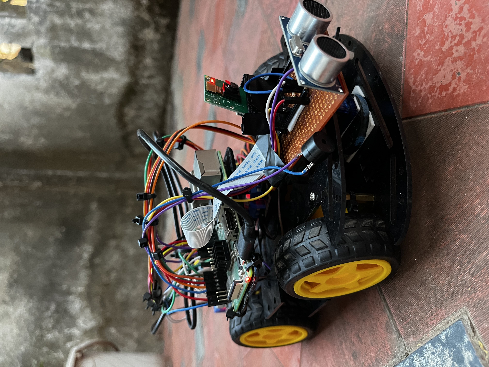
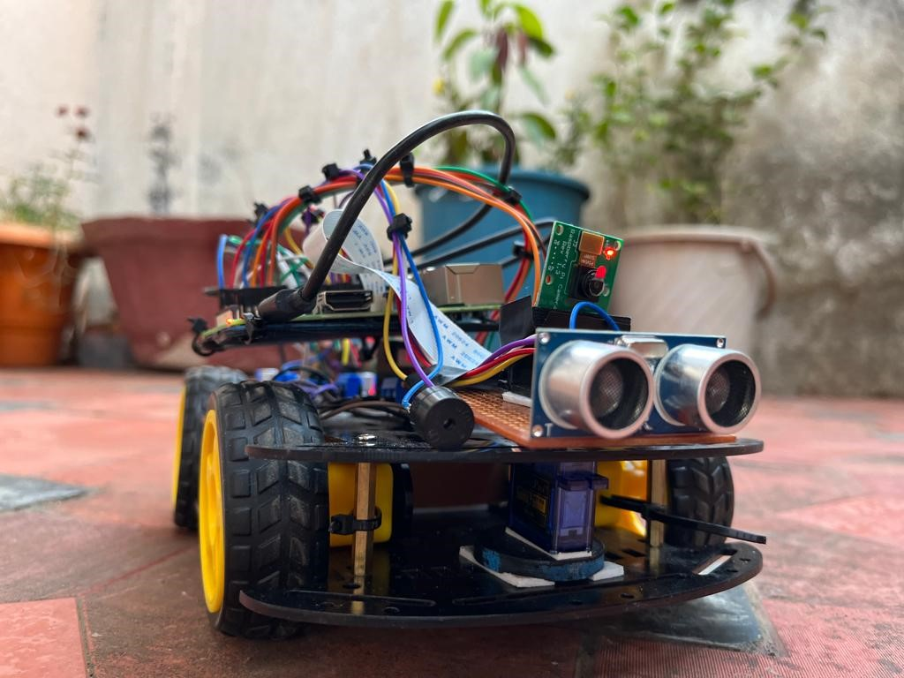
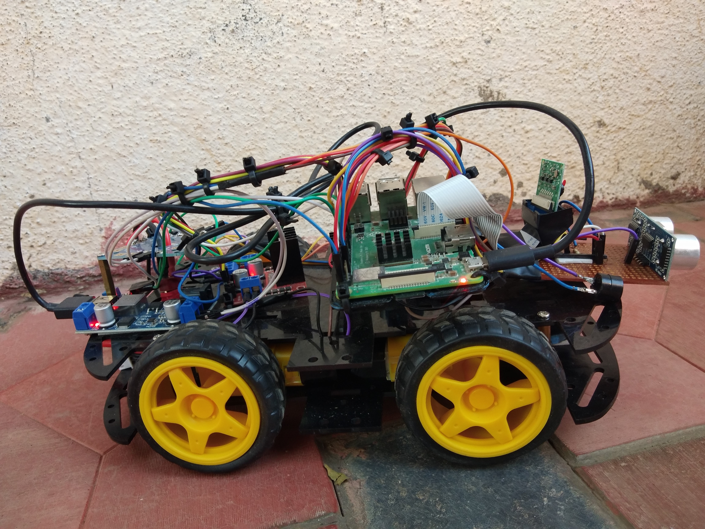
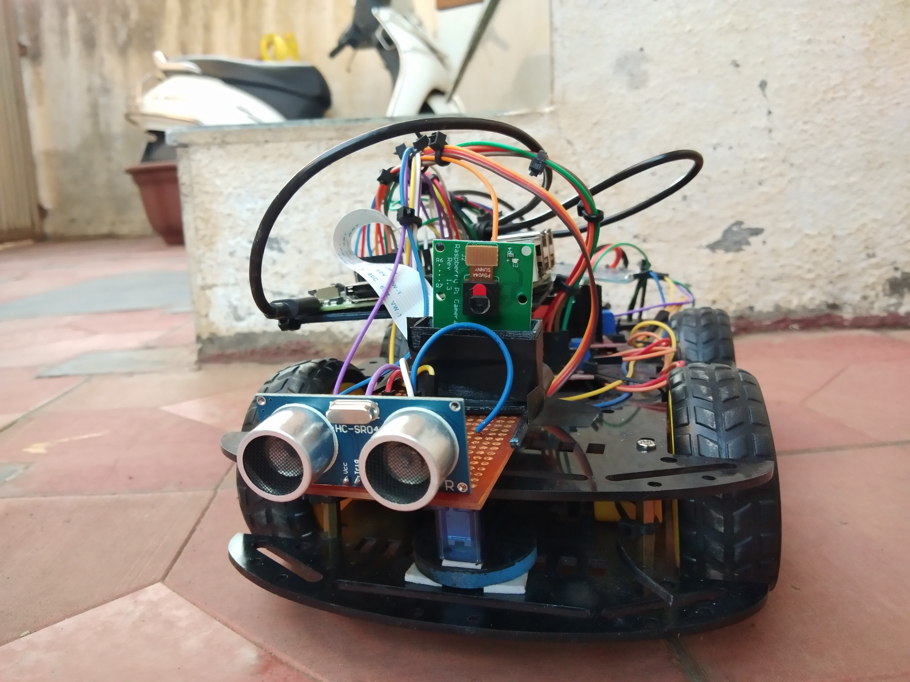
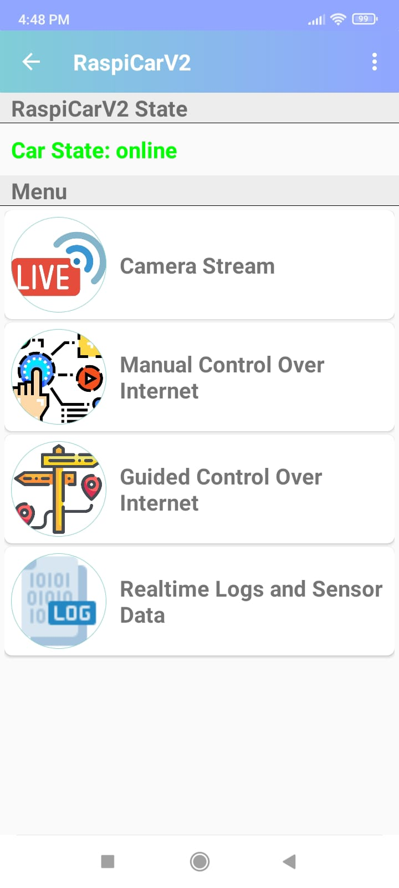
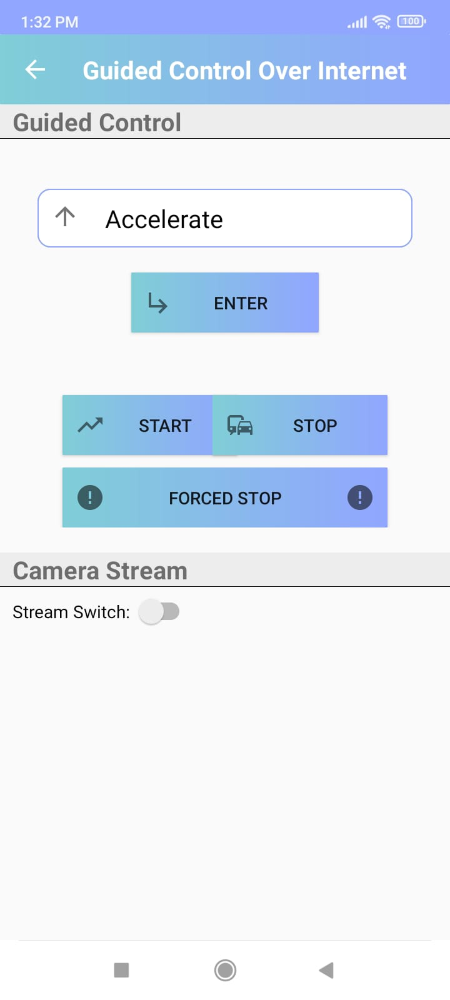
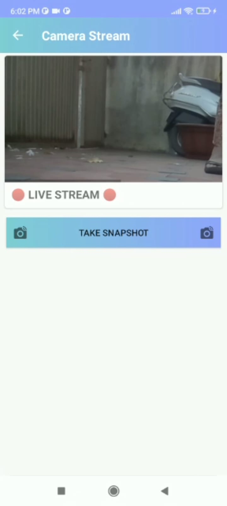

# RaspiCarV2

  
 

# Description

RaspiCarV2 is a prototype of an IoT-based surveillance car implemented using Rasberry Pi 3B+ and Firebase for better control over the cloud.
This project is still in the development phase. New features and functionalities will be introduced soon...

# PYQT Desktop client

# Android Application
   
